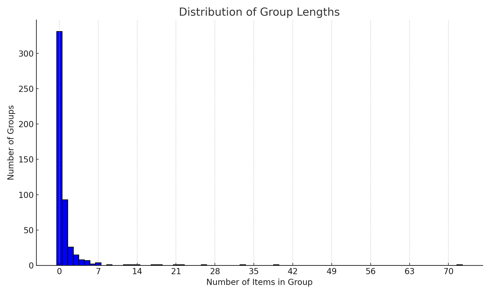

# Text Sticker Selection Project

This project aims to select appropriate text stickers based on a set of image captions for automated photobook design. By interacting with the OpenAI GPT-3 API, it generates a theme and selects stickers that align with the generated theme. The primary function utilized for this task is `caption_stickering`.

## Getting Started

These instructions will get you a copy of the project up and running on your local machine.

### Prerequisites

- Python 3.6 or higher
- `openai` library installed
- OpenAI API key set as environment variable

```bash
pip install openai
```

### Installation

Clone the repository to your local machine:

```bash
git clone https://github.com/your-username/Text-Sticker-Selection.git
cd Text-Sticker-Selection
```

## Usage

Import the `caption_stickering` function from the provided script.
`stickers` is a list of possible sticker slugs.
`spread_captions` is a nested list that may contain one or more lists of captions.

Example usage:

```python
from text_sticker_selection import caption_stickering

# Define the stickers and spread captions
stickers = ['Happy Birthday!', 'Best Wishes', 'Congratulations!', ...]
spread_captions = [['A cat chasing a ball', 'A dog barking at a tree'], 
                   ['A family having a picnic', 'Kids playing in the park']]

# Call the function
response = caption_stickering(stickers, spread_captions, report_cost=True)
print(response)
```

## Development

#### **Token Count Computation**
- **Initially**: Utilized `tiktoken` from OpenAI, but it provided counts before API calls.
- **Now**: Tokens are computed post-response using `response["usage"]["total_tokens"]`. The cost is determined by multiplying with the rate for `gpt-3.5-turbo-16k` which is `$0.003/1K`.

#### **Tokens in the Automated Phrase List**
The list contains `3,770` tokens.

#### **Formatting ChatGPT Outputs: Challenges & Solutions**
- **Phrase Selection**: Despite emphasizing the use of only the provided list, the model sometimes creates its own phrases.
- **Output Format**: Requesting outputs as structured data (like JSON) led to more consistent results than formatted text.
- **Standardizing Answers**: Defining word limits and logical progression (like theme identification) improved output accuracy.
- **Number of Responses**: Specifying the required number of responses or explicitly defining the count in prompts was essential to get multiple sets of captions.

#### **Model Selection Rationale**
- **Token Capacity**: The `gpt-3.5-turbo-16k` model was chosen due to nearing the 4k token limit with just the phrases.
- **Cost Efficiency**: The `gpt-4` 8k model's cost was 10 times that of `gpt-3.5-turbo-16k`.

#### **Checks for Production Deployment**
- Verify the number and validity of outputted phrases, specifically verify they are actually in original list.
- Ensure outputs are non-repetitive, especially for similar themes.


Alternate models that could be used -- other than OpenAI models?


## Limitations

The primary limitations are token limit and runtime. 

Using the default model `gpt-3.5-turbo-16k` the token limit is 16k, and the cost is .003 per 1k tokens. Using the full list of sticker slugs and this response format, a large number (~200) of image captions can be given at one time.

However, the runtime is approximately 1.5 per spread with potentially significant variation based on the number of images in a spread.

### Potential Text Phrase Encoding
A potential solution to reducing token count & thereby time and cost is to reduce the sticker slug list to a list of representative stickers for stickers with identical keyword descriptions. The process outlined below was used to generate `representative_slugs.csv` and `encoding_groups.json`

1. **One-Hot Encoding**: Keywords were one-hot encoded to create binary vectors representing the presence or absence of each keyword.
2. **Encoding Groups Identification**: Unique binary vectors were identified as unique encoding groups, with each group assigned a unique identifier.
3. **Centroid-based Representative Selection**: The centroid of each encoding group was computed, and the data point closest to the centroid was selected as the representative.
4. **Output Generation**: A JSON object and a CSV file were created to present the representatives and their respective encoding groups.

This process results in 499 encoding groups with the following distribution.


